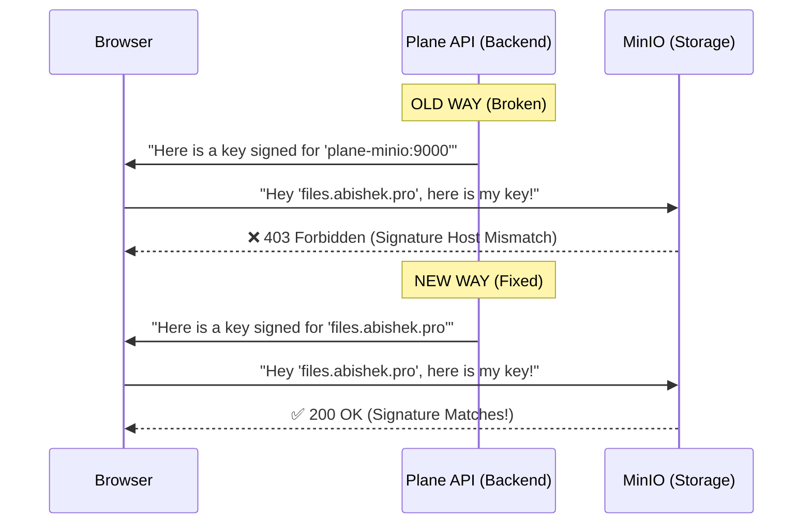

# Project: Self-Hosted Plane (PMS) "Lite Edition"

**Domain:** `plane.abishek.pro`
**Infrastructure:** Local Docker Host (Personal PC) via Cloudflare Tunnel
**Status:** ✅ Production Ready

## 1. Executive Summary

The goal was to self-host **Plane** (an open-source Project Management System) on a personal computer with limited resources (RAM/CPU), making it accessible via the public internet securely.

Unlike a standard server deployment, this required aggressive optimization (the **"Lite Mode"** strategy), removing redundant enterprise features like automated backups and complex edge routing to fit within the hardware constraints while maintaining stability via Cloudflare Zero Trust.

---

## 2. Architecture Overview

### The "Mainstream" Stack

We transitioned from a complex microservices mesh to a streamlined flow:

- **Ingress:** Cloudflare Tunnel (`cloudflared`) - _No router ports opened._
- **Routing:** Nginx (`plane-edge`) - _Internal traffic cop._
- **Frontend:** `plane-web` (React) - _Served via Nginx._
- **Backend:** `plane-api` (Django/Python) - _Gunicorn Server._
- **Storage:** `plane-minio` (S3 Compatible) - _Served via `files.abishek.pro`._
- **Database:** Postgres & Redis.

---

## 3. Project Timeline & Execution Log

### Phase 1: The "Lite Mode" Strategy

**Objective:** Reduce RAM usage by ~50% compared to the official production setup.

- **Action:** Created `docker-compose-pc.yaml`.
- **Optimization 1 (Removal):** Deleted `plane-migrator` (switched to manual migration).
- **Optimization 2 (Removal):** Deleted `db-backup`, `minio-backup`, and `plane-backup` containers (switched to manual export).
- **Optimization 3 (Limits):** Added `deploy: resources: limits` to cap RabbitMQ and Postgres memory usage.

### Phase 2: Networking & Domain Strategy

**Objective:** Secure public access without exposing home IP.

- **Action:** Configured Cloudflare Tunnel.
- **Domain Mapping:**
  - `plane.abishek.pro` → Application (UI/API)
  - `files.abishek.pro` → Object Storage (MinIO)

- **Why Split Domains?** To avoid complex path rewriting rules (e.g., `/uploads` conflicting with API routes), we dedicated a subdomain for file storage.

### Phase 3: Stabilization (The Debugging Phase)

This was the critical phase where we resolved multiple "Showstopper" bugs.

### Phase 4: Feature Enhancements

**Objective:** Improve usability for personal workflows.

- **Action:** Integrated custom Bulk Import/Export modal.
- **Feature:** Added quick project creation with feature toggles (Cycles, Modules, etc.) directly in the import UI.

---

## 4. Debugging Log & Fallbacks (The "War Stories")

### Bug 1: The "Zombie" Containers (Dependency Failures)

- **Symptom:** `plane-web` and `create-bucket` refused to start, citing `dependency failed`.
- **Root Cause:** In our "Lite" cleanup, we accidentally removed the `healthcheck` blocks from `plane-minio` and `plane-api`. Docker's `depends_on: condition: service_healthy` requires these checks to exist.
- **Fix:** Restored the `healthcheck` blocks using `curl` for MinIO and a Python socket check for the API.

### Bug 2: The Gunicorn Crash

- **Symptom:** API container kept restarting with `invalid int value: ''`.
- **Root Cause:** The variable `GUNICORN_WORKERS` was unset. The default shell expansion failed.
- **Fix:** Explicitly set `GUNICORN_WORKERS: 1` in the environment variables. This also aided our low-RAM goal.

### Bug 3: The "Double API" Error (404s)

- **Symptom:** Browser console showed requests to `https://plane.abishek.pro/api/api/instances`.
- **Root Cause:** We defined `VITE_API_BASE_URL` as `.../api`. The frontend code _also_ appends `/api`, resulting in duplication.
- **Fix:** Updated build args to point to the **Root Domain** only (`https://plane.abishek.pro`) and forced a rebuild (`--build`).

### Bug 4: The Infinite Login Loop

- **Symptom:** Logging in redirected back to the login page infinitely.
- **Root Cause:** CSRF Protection. The browser sent HTTPS requests, but Cloudflare talked to Docker via HTTP. Django flagged this mismatch as a "Man-in-the-Middle" attack and rejected the session cookie.
- **Fix:** Added trust configurations to `plane-api`:
  ```yaml
  CSRF_TRUSTED_ORIGINS: "https://plane.abishek.pro"
  PROXY_SCHEME: "https"
  ```
- **Correction:** We also cleared browser cookies to reset the corrupted session state.

### Bug 5: The 502 Bad Gateway (API Instability)

- **Symptom:** Cloudflare returned `502` errors on API calls, despite the API container running.
- **Root Cause:** Cloudflare Tunnel sometimes struggles to speak directly to Gunicorn (Python) workers if they are slow or headers are malformed.
- **Fallback Strategy:** We re-introduced **Nginx (`plane-edge`)**.
- **Why:** Nginx acts as a stable buffer. Cloudflare talks to Nginx (Robust) → Nginx talks to Gunicorn (Fragile).
- This stabilized the connection instantly.

### Bug 6: The "403 Forbidden" Asset Error

- **Symptom:** The application loaded fine, but profile pictures and file uploads failed with a `403 Forbidden` error. The URL contained long query parameters like `?X-Amz-Signature=...`.
- **Root Cause:** **AWS Signature Mismatch**. MinIO uses the AWS S3 v4 Signature protocol. The Plane API was generating a signature based on the internal hostname (`http://plane-minio:9000`), but the browser tried to use that signature to access the external hostname (`https://files.abishek.pro`). MinIO rejected the request because the "Host" header in the signature did not match the request.
- **Fix:** Updated `AWS_S3_ENDPOINT_URL` in `docker-compose-pc.yaml` to point to the **public domain** (`https://files.abishek.pro`). This forces the API to calculate signatures using the external hostname.



---

## 5. Final Critical Configuration

### The "Edge" Router (Nginx)

We restored this lightweight service to handle internal routing.

```yaml
plane-edge:
  image: nginx:alpine
  depends_on:
    - plane-web
    - plane-api
  ports:
    - "8080:80"
  volumes:
    - ./edge.conf:/etc/nginx/conf.d/default.conf:ro
```

### The Cloudflare Rules (Simplified)

Because Nginx now handles the `/api` logic, Cloudflare only needs two rules:

1. **Public Hostname:** `plane.abishek.pro`
   - **Service:** `http://plane-edge:80` (Points to Nginx, not Web directly)

2. **Public Hostname:** `files.abishek.pro`
   - **Service:** `http://plane-minio:9000`

---

## 6. Maintenance Commands

**Start/Update System:**

```bash
docker compose -f docker-compose-pc.yaml up -d --remove-orphans
```

**Rebuild Frontend (If changing URLs):**

```bash
docker compose -f docker-compose-pc.yaml up -d --build plane-web
```

**Manual Database Backup (Since auto-backup is removed):**

```bash
docker exec -t plane-selfhost-plane-db-1 pg_dumpall -c -U plane > backup_$(date +%F).sql
```

## 7. Future Roadmap

- **Analytics:** Cloudflare Web Analytics is currently injecting JS beacons for traffic monitoring.
- **Storage:** If local disk space runs out, we can re-point `files.abishek.pro` to an actual AWS S3 bucket without changing the app code.
- **Auth:** Currently using Email/Password. Can integrate Google/GitHub OAuth via the Admin panel since the domain is now public and valid.

## 8. Next Step

Your "Lite Mode" Self-Hosted Plane instance is now fully operational, secure, and documented.

- **URL:** https://plane.abishek.pro
- **Storage:** https://files.abishek.pro
- **Infrastructure:** 100% Local Docker.
